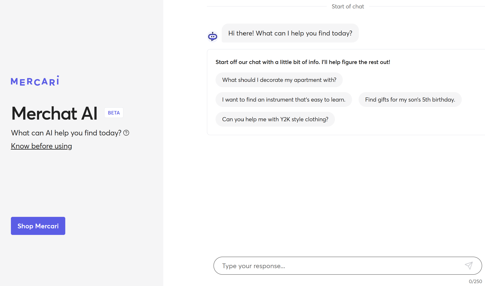
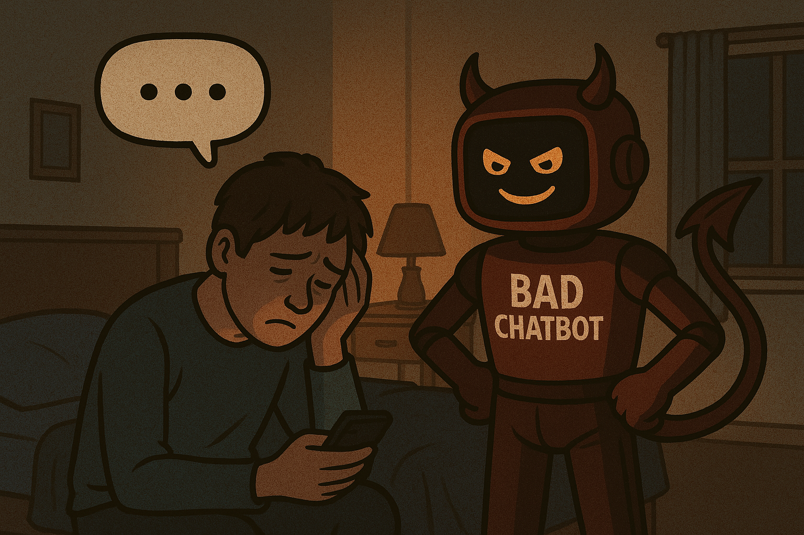

# Chatbots

*The above image was generated by ChatGPT.*

## Table of Contents

1. [Introduction](#introduction)
2. [What are chatbots?](#what-are-chatbots)
3. [What makes a chatbot good?](#what-makes-a-chatbot-good)
    - [The best AI chatbots of 2025](#the-best-ai-chatbots-of-2025)
4. [What makes a chatbot bad?](#what-makes-a-chatbot-bad)
    - [Unfortunate outcomes of chatbot usage](#unfortunate-outcomes-of-chatbot-usage)
5. [References](#references)

## Introduction

This report provides an overview of chatbots, their purpose, and their key features. It explores the fundamental aspects that define chatbots, including their applications and examples. Additionally, the report highlights common shortcomings that can negatively impact the user experience, offering insights into what makes a chatbot ineffective. By understanding these elements, readers can gain a deeper appreciation of chatbot technology and its challenges.

## What are chatbots?

According to [Forbes](https://www.forbes.com/advisor/business/software/what-is-a-chatbot/), a chatbot is a **software application that simulates human conversation** through voice commands, text chats, or both. Chatbots are powered by artificial intelligence (AI) and natural language processing (NLP) technologies, enabling them to understand and respond to user queries in a conversational manner.

[IBM](https://www.ibm.com/think/topics/chatbot-design) claims there are two types of chatbots: **rule-based** and **AI-based**. Rule-based chatbots follow a set of **predefined rules** and can only respond to specific commands or keywords. They are limited in their ability to understand complex queries and often require users to follow a strict format. On the other hand, AI-based chatbots leverage **machine learning algorithms** and **natural language processing** to understand context, intent, and sentiment, allowing for more dynamic and human-like interactions.

| Key            | Description                                                              |
|-----------------|--------------------------------------------------------------------------|
| **Definition**  | Application of LLM                                                      |
| **Purpose**     | Respond to human input in a way that mimics natural human conversation  |
| **Examples**    | [ChatGPT](https://chatgpt.com/), [Mercari's Merchat AI](https://www.mercari.com/merchat/?msockid=0763cb8a3f3a6eeb1306df5d3e176fcf), [Ada Health's health manager](https://ada.com/app/)                                            |
| **Key features**| Traditional chat room/message interface, un/structured input options    |
| **Use case**    | Customer service, marketing, sales                                       |

## What makes a chatbot good?

According to IBM's [chatbot design practices](https://www.ibm.com/think/topics/chatbot-design), a good chatbot:

- features a UI that is **easy to use, responsive, engaging, and reflective of the brand**
- provide services in the right domain, such as instances where two-way conversations are needed
- balance short- and long-term business goals
- incorporates business process management and process mining to improve user experience and business outcomes

### The best AI chatbots of 2025

According to [ZDNET](https://www.zdnet.com/article/best-ai-chatbot/#google_vignette), the best AI chatbots of 2025 are as follows:

|Chatbot|Best in|Pros|Cons|
|---|---|---|---|
|[ChatGPT](https://chatgpt.com/)|Overall|Writing skills; STEM knowledge; conversational|Limits to GPT-4o; downgrades free users to GPT-4o-mini when at capacity|
|[Copilot](https://copilot.microsoft.com/chats/v5NsEcTdNQccre2FapCVD)|ChatGPT alternative|Access to the internet; links back to sources; uses OpenAI's LLM|Grounded in Bing; not as strong as ChatGPT|
|[Claude](https://claude.ai/login)|Privacy|Upload document support; chat controls; light and dark modes|Unclear usage cap; knowledge cut-off|
|[Perplexity.ai](https://www.perplexity.ai/)|Search|Links to sources; access to internet; simple UI|Paid subscription required for GPT-4 access; some irrelevant suggestions|
|[Jasper](https://www.jasper.ai/)|Business and marketing|Different writing templates; copyediting features; plagiarism checker|Subscription required to try; steep cost|

See the [full article](https://www.zdnet.com/article/best-ai-chatbot/) for more details on the AI chatbots listed above, as well as [You.com](https://you.com/), [Chatsonic](https://writesonic.com/chat?ref=tuyen19), [Gemini](https://gemini.google.com/), [Socratic](https://www.socratic.com/), and [HuggingChat](https://huggingface.co/chat/).

## What makes a chatbot bad?

According to [Tech Business News](https://www.techbusinessnews.com.au/blog/why-customers-dont-like-or-hate-chatbots-bad-for-business/), the following are common reasons why consumers dislike chatbots:

- lack of personalization
- inability to resolve complex issues
- lack of human interaction
- lack of trust
- privacy and data security concerns
- accuracy of information collected by chatbots
- time consumption

### Unfortunate outcomes of chatbot usage

[Listverse](https://listverse.com/2025/04/02/ten-disturbing-news-stories-involving-chatbots/) features ten disturbing news stories involving chatbots, including:

- [Man files complaint after ChatGPT falsely claimed he murdered his children](https://youtu.be/uP0E1icYKLw)
- [Michigan man speaks out after getting threatening message from Google AI chatbot](https://youtu.be/LEEyuFmTaJw)
- several stories involving Character.ai:
  - [Digital clones of deceased teenagers Molly Russell and Brianna Ghey appear on Character.AI](https://www.ibtimes.co.uk/digital-clones-deceased-teenagers-molly-russell-brianna-ghey-appear-characterai-1728127)
  - [AI Chatbot Encourages Teen to Kill Parents Over Screen Time Limits](https://www.youtube.com/watch?v=u9KrjH9PSm0)
  - [Florida mother files lawsuit against Character.ai over son's death by suicide](https://youtu.be/LLdS1e5c6Ok)

These stories and their frequency demonstrate how chatbots can negatively influence humans as a result of their exact characteristic they receive so much praise for: the ability to simulate human conversation.

AI chatbots are constantly improving, but incidents such as the ones listed above are always a possibility. [OpenAI](https://help.openai.com/en/articles/8554982-how-should-i-report-a-gpt) allows users to flag or report GPTs created by other users. Despite the frequency and severity of incidents stemming from Character.AI, the service's UI does not feature any clear reporting features.

## References

ABC News. (2024, October 24). Florida mother files lawsuit against Character.ai over son’s death by suicide [Video]. YouTube. [https://www.youtube.com/watch?v=LLdS1e5c6Ok](https://www.youtube.com/watch?v=LLdS1e5c6Ok)

CBS Detroit. (2024, November 21). Michigan man speaks out after getting threatening message from Google AI chatbot [Video]. YouTube. [https://www.youtube.com/watch?v=LEEyuFmTaJw](https://www.youtube.com/watch?v=LEEyuFmTaJw)

Firstpost. (2024, December 16). AI Chatbot Encourages Teen to Kill Parents Over Screen Time Limits | Vantage with Palki Sharma [Video]. YouTube. [https://www.youtube.com/watch?v=u9KrjH9PSm0](https://www.youtube.com/watch?v=u9KrjH9PSm0)

Frater, J. (2025, April 2). Ten disturbing news stories involving chatbots. Listverse. [https://listverse.com/2025/04/02/ten-disturbing-news-stories-involving-chatbots/](https://listverse.com/2025/04/02/ten-disturbing-news-stories-involving-chatbots/)

Giannelis, M., & Giannelis, M. (2024, November 22). Why Customers Don’t Like Or Hate Chatbots – Annoying & Bad For Business. Tech Business News. [https://www.techbusinessnews.com.au/blog/why-customers-dont-like-or-hate-chatbots-bad-for-business/](https://www.techbusinessnews.com.au/blog/why-customers-dont-like-or-hate-chatbots-bad-for-business/)

Glover, E. (2023, December 4). 19 Chatbot examples to know. Built In. [https://builtin.com/artificial-intelligence/chatbot-examples](https://builtin.com/artificial-intelligence/chatbot-examples)

How should I report A GPT?. OpenAI. (n.d.). [https://help.openai.com/en/articles/8554982-how-should-i-report-a-gpt](https://help.openai.com/en/articles/8554982-how-should-i-report-a-gpt)

NBC News. (2025, March 28). Man files complaint after ChatGPT falsely claimed he murdered his children [Video]. YouTube. [https://www.youtube.com/watch?v=uP0E1icYKLw](https://www.youtube.com/watch?v=uP0E1icYKLw)

Ortiz, S. (2024, December 13). The best AI chatbots of 2025: ChatGPT, Copilot, and notable alternatives. ZDNET. [https://www.zdnet.com/article/best-ai-chatbot/#google_vignette](https://www.zdnet.com/article/best-ai-chatbot/#google_vignette)

Patel, V. (2024, November 5). Digital clones of deceased teenagers Molly Russell and Brianna Ghey appear on Character.AI. International Business Times UK. [https://www.ibtimes.co.uk/digital-clones-deceased-teenagers-molly-russell-brianna-ghey-appear-characterai-1728127](https://www.ibtimes.co.uk/digital-clones-deceased-teenagers-molly-russell-brianna-ghey-appear-characterai-1728127)

Searcoid, C. O. (2023, August 15). Chatbot use cases: 25 real-life examples. LeadDesk. [https://leaddesk.com/blog/chatbot-use-cases-25-real-life-examples/](https://leaddesk.com/blog/chatbot-use-cases-25-real-life-examples/)

Shweta. (2022, August 21). What is a chatbot? Everything you need to know. Forbes Advisor. [https://www.forbes.com/advisor/business/software/what-is-a-chatbot/](https://www.forbes.com/advisor/business/software/what-is-a-chatbot/)